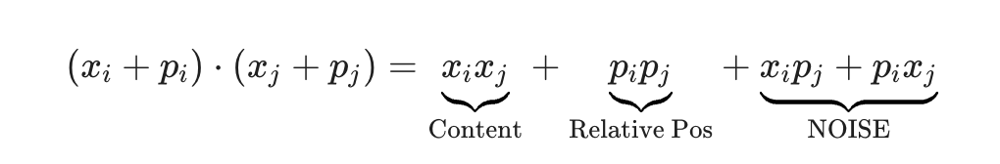

- Unittests:
    - shape shouldn't change post operation
    - magnitude shouldn't change post operation
    - rotation metrics should have determinant = 1
    - linerity (f(a+b) = f(a) + f(b))
    - relative distance inveriance
    <!-- - dot product identity tests -->

- table of content:
    - [Gemini conversation link](#gemini-conversation)
    - [Key Learnings](#key-learnings)
    - [RoPE derivation](#rope-derivation)
    - [Mistakes in my initial implementation](#rope-implementation-critical-mistakes--learnings)

# Gemini conversation

* [[gemini conversation link](https://gemini.google.com/app/f84e1ab8c36b9a31?pli=1)] contains:
    - rope derivation
    - confusion regarding how ROPE relative distance inveriance from sinusoidal one 
    - how sinusoidal v/s rope nuance come at scale [**complex i.e. n_heads and deep networks i.e. n_layers and massice training corpus**] only and the choice should be based on the application [**do you need both `absolute+relative` or `relative only` information**]
    - how to come up with the theta's equation [why 10000 as base and how it is a function of your model's context length choice i.e. CodeLlama has 1M, Llama3 has 500k etc.]
    - why theta is negative and not positive [you need decay and not explosion in the frequency space]
    - learnings/mistakes in [my implementation](https://github.com/Exorust/TorchLeet/commit/5686412cc95d8c13d08a93319699abf30b2b3f98)

---
# Key Learnings

* Sinusoidal v/s RoPE:
    - ROPE is different from Sinusoidal positional embeddings in terms of 
        - (1) multiplication v/s addition 
        - (2) equation - while the angle equation is same, alternative sin-cos v/s rotation metric part is diff 
        - (3) explicit for ROPE v/s hidden among x_m * p_m term (function of pure m and n) and not just p_m * p_n terms which are function of (n-m)

* torch nuances:
    - tensor.device() can break things at run time
    - dtypes can cause silent failures [10000**(-2i/n_dim) would be in FP16 unless specified explicitly. exponents at these level run into underflow or overflow easily and run into precision errors so it is  better to use float32 for this operation and casting it back to float16 after calculation]
    - tensor dimensions are everything -> how to write code which doesn't assume input shape / break with input tensor shapes

---
# RoPE derivation:

The derivation of Rotary Positional Embeddings (RoPE) is elegant because it starts with a strict mathematical requirement and discovers that **rotation** is the only natural solution.

Here is the step-by-step derivation, moving from the goal to the final equation.

### 1. The Goal: Relative Positional Structure

We want to find a function  that transforms a word vector  at position  into a new vector (let's call them query  and key ).

The core requirement is that the **inner product** (attention score) between a query at position  and a key at position  should depend **only** on the distance , not on the absolute values of  or .

Mathematically, we want a function  such that:

### 2. The 2D Case (Using Complex Numbers)

The easiest way to solve this is to treat our embedding vectors not as lists of numbers, but as **complex numbers** in a 2D plane. This simplifies the math because rotation in 2D is just multiplication by .

Let's represent the word vector  as a complex number with a magnitude  and an angle :

We are looking for a transformation  that acts on this complex number. Let's assume this transformation separates the "content" (magnitude) from the "position" (angle):

*Note: We assume it doesn't change the magnitude  because position shouldn't make a word "stronger," just "oriented" differently.*

Let:

where  is the unknown function that encodes the position.

### 3. Solving for the Function

Now, let's take the inner product. In complex numbers, the standard dot product of two vectors is the real part of one multiplied by the conjugate of the other:

Substitute our definitions:

Group the terms:

**Here is the critical moment.**
We need this result to depend **only** on .
Looking at the last term:

For this to be a function of , the exponent must satisfy:

This is a classic arithmetic progression. The function that satisfies  is a **linear function**:

**Conclusion of the derivation:**
To satisfy the relative distance constraint, the positional encoding **must** simply add an angle  to the word's existing angle.

Multiplying by  is exactly the definition of **rotating by an angle of **.

### 4. Converting Back to Real Vectors (Matrices)

Computers don't usually store neural network weights as complex numbers; they use real vectors. We need to convert that complex multiplication  back into a real matrix operation.

If we write the complex number  as a 2D vector :

Converting this back to vector notation gives us the famous **Rotation Matrix**:

### 5. Generalizing to  Dimensions

Models like GPT or LLaMA have embeddings of size , not 2. How do we apply a 2D rotation to 4096 dimensions?

We divide the vector into  pairs (chunks of 2):

We apply a rotation matrix to each pair independently. However, we don't use the same angle  for every pair. To capture different "resolutions" of position (as discussed before), we use a different frequency  for each pair .

This creates a massive **Block Diagonal Matrix**:

### Summary of the Derivation logic

1. **Assume** we want the dot product to be a function of relative distance .
2. **Represent** embeddings as complex numbers .
3. **Discover** that the only transformation preserving magnitude while satisfying the relative distance constraint is multiplying by .
4. **Translate** that complex multiplication into a 2D rotation matrix.
5. **Stack** those matrices to handle high-dimensional vectors.

---

# RoPE Implementation: Critical Mistakes & Learnings

This document logs the subtle but critical errors encountered while [implementing Rotary Positional Embeddings (RoPE) from scratch](https://github.com/Exorust/TorchLeet/commit/5686412cc95d8c13d08a93319699abf30b2b3f98).

### 1. Device Mismatch Crash

* **Brief Mistake:** Using default `torch.arange` without specifying the device.
* **Description:** The tensors `timestamps` and `theta` were created using `torch.arange()`, which defaults to CPU. When the input tensor `x` is on a GPU (CUDA), performing operations between them (like `torch.outer`) triggers a device mismatch error because PyTorch cannot mix CPU and GPU tensors.
* **Implication:** The code works fine during debugging on a CPU but crashes immediately when moved to a GPU for actual training.
* **Is Silent Failure?** **No** (Raises `RuntimeError`).

### 2. The "Shape Trap" (Sequence vs. Heads)

* **Brief Mistake:** Inferring sequence length blindly from `x.shape[-2]`.
* **Description:** The code assumed `x.shape[-2]` is always the sequence length. However, standard Transformer tensors often have the shape `[Batch, Heads, SeqLen, HeadDim]`. In this layout, `shape[-2]` is the Sequence Length, but if the layout is `[Batch, SeqLen, Heads, HeadDim]`, `shape[-2]` becomes the Number of Heads.
* **Implication:** The model generates position indices `[0, 1, 2, 3]` (for 4 heads) instead of `[0, 1, ..., 4096]` (for the sequence). The rotation is applied based on *which head* is processing the data, not *which word* it is. This completely breaks the attention mechanism.
* **Is Silent Failure?** **Yes** (Model trains but learns nothing useful).

### 3. Autoregressive Inference Failure

* **Brief Mistake:** Always starting `timestamps` from 0.
* **Description:** The implementation calculates `timestamps = torch.arange(0, seq_len)`. During training (processing the whole sentence), this is correct. During inference (generating one word at a time), the input `x` has a sequence length of 1. The code forces the timestamp to be `0` for every new word generated.
* **Implication:** Every generated word is treated as the "first word" of the sentence. The model loses all concept of order and position, leading to gibberish output during text generation (KV-cache corruption).
* **Is Silent Failure?** **Yes** (Generation produces repetitive or nonsensical text).

### 4. Precision Loss (Float16 Hazard)

* **Brief Mistake:** Computing frequencies (`theta`) in low precision.
* **Description:** If the input `x` is in `float16` (common for training), the operation `10000**(...)` inherits that type. `float16` has limited precision for exponentials, causing small frequencies (for long-range context) to underflow to zero or round off significantly.
* **Implication:** The "long-term memory" of the position embedding degrades. The model struggles to capture dependencies between tokens that are far apart.
* **Is Silent Failure?** **Yes** (Training proceeds, but convergence is slower or final performance is degraded).

### 5. Pairing Strategy Incompatibility

* **Brief Mistake:** Using Interleaved (`x[0], x[1]`) instead of Sliced (`x[0], x[dim/2]`) pairing.
* **Description:** The code paired adjacent elements `(0,1), (2,3)`. Standard implementations (like LLaMA, HF) split the vector into two halves and pair element `i` with element `i + dim/2`.
* **Implication:** This is mathematically valid if training from scratch. However, it makes the implementation **incompatible with pre-trained weights** (like LLaMA). Loading standard weights into this custom implementation will result in garbage outputs because the rotation partners are mismatched.
* **Is Silent Failure?** **Yes** (Model runs, but transfer learning fails silently).

### 6. Recomputing Constants

* **Brief Mistake:** Recalculating `sin` and `cos` tables on every forward pass.
* **Description:** The implementation generates the frequency tables from scratch every time the function is called.
* **Implication:** Significant computational overhead. In a training loop with millions of steps, this wastes GPU cycles re-doing identical math operations that could have been cached.
* **Is Silent Failure?** **Yes** (Code is correct but unnecessarily slow).

---

Would you like me to help you write the `fixed_rope_implementation.py` file to go along with this readme?
